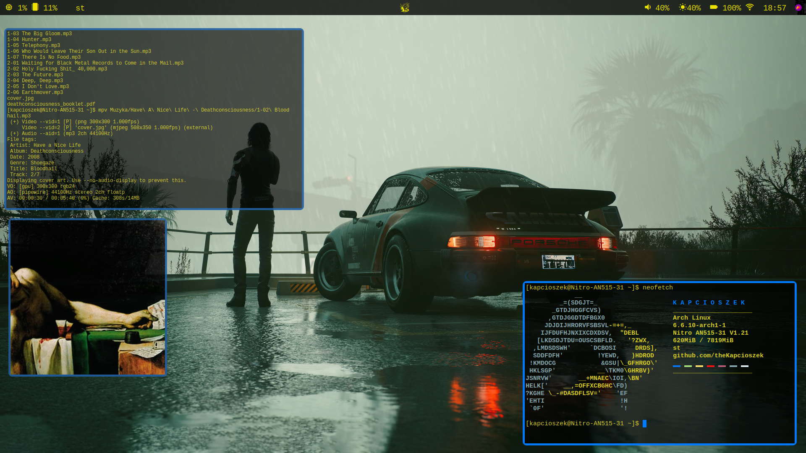

# dotfiles-i3
Dotfiles for my i3 rice

## What software I used:
- **OS**: [Arch Linux](https://archlinux.org/)
- **WM**: [i3](https://i3wm.org/)
- **Terminal**: [Luke Smith's Suckless Terminal](https://github.com/LukeSmithxyz/st)
- **App launcher**: [dmenu](https://tools.suckless.org/dmenu/)
- **Bar**: [Polybar](https://github.com/polybar/polybar)
- **Compositor**: [Picom](https://github.com/jonaburg/picom)
- **Screenshots**: [Flameshot](https://flameshot.org/)
- **System fetch**: [Neofetch](https://github.com/dylanaraps/neofetch)

It is a very simple config, nothing fancy, but I like it and I am proud of it.

[My wallpaper folder](https://www.dropbox.com/scl/fo/s8p5yrz9um2axcrx5ajws/h?rlkey=pysbqyjrbrxxazervyu45q901&dl=0)  
(I found almost all wallpapers online. I do not claim credit to them.)

  

